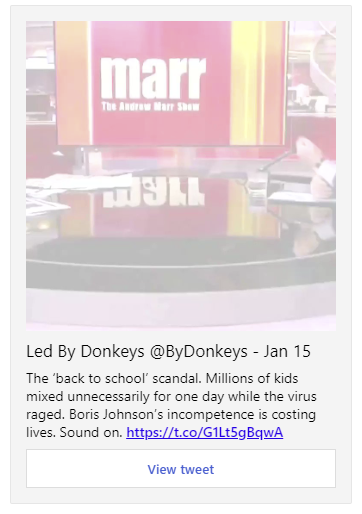

# Rachael - C# Azure Bot 


## Features:
* .NET Core [3.1](https://dotnet.microsoft.com/download/dotnet-core/3.1)
* Running on a consumption model as an Azure serverless function **[v3.x](https://docs.microsoft.com/en-us/azure/azure-functions/functions-versions)**
* Connected to the [LUIS](https://eu.luis.ai) language understanding service **[v2.0](https://docs.microsoft.com/en-us/azure/cognitive-services/luis/luis-migration-api-v3)**
* Bot Framework SDK **[v4](https://github.com/microsoft/botframework-sdk)**
* Connected to twitter API **[v2](https://developer.twitter.com/en/docs/twitter-api/early-access)**
* Custom OAuth [ASP.NET DelegatingHandler](https://docs.microsoft.com/en-us/aspnet/web-api/overview/advanced/http-message-handlers)
* Uses Adaptive cards **[v1.2](https://adaptivecards.io/designer/)** for web chat

## To build & Run:

* Using [Azure Functions Core Tools v3](https://github.com/Azure/azure-functions-core-tools)
```
$ func host start --csharp
```
* Install `ms-azuretools.vscode-azurefunctions` vscode extension. Then `F5` for Debugging in VSCode.

### Run botframework-cli tools locally
```
docker build -t wilsoncg/bf-cli .
docker run wilsoncg/bf-cli luis
```

### Bot Framework Emulator application
Here you can see Rachael in the bot framework emulator [v4](https://github.com/Microsoft/BotFramework-Emulator):


## AdaptiveCards vs HeroCard
Adaptive cards are only supported in certain channels. We therefore render tweets as an AdaptiveCard for the webchat channel, and as a HeroCard for the skype channel. Refer to the [Azure bot service channels reference.](https://docs.microsoft.com/en-us/azure/bot-service/bot-service-channels-reference?view=azure-bot-service-4.0)

### Tweet as HeroCard:



### Tweet as AdaptiveCard:


## Nuget referenced packages:
* Microsoft.NET.Sdk.Functions - [Azure Functions docs](https://docs.microsoft.com/en-us/azure/azure-functions/)
* Microsoft.Bot.Builder.Azure - [Bot Framework SDK docs](https://docs.microsoft.com/en-us/azure/bot-service/?view=azure-bot-service-4.0)

## Useful links:

* Bot Framework SDK repo https://github.com/microsoft/botframework-sdk/blob/master/README.md
* Microsoft.Bot.Builder.* packages & repo https://github.com/microsoft/botbuilder-dotnet/
* To learn how to debug Azure Bot Service bots, please visit https://aka.ms/bf-docs-azure-debug
* Full list of app settings variables: https://docs.microsoft.com/en-gb/azure/azure-functions/functions-app-settings
* Azure functions authentication/keys https://github.com/Azure/azure-functions-host/wiki/Http-Functions
* Adaptive cards SDK https://docs.microsoft.com/en-us/adaptive-cards/sdk/authoring-cards/net

## Portal links:

* Microsoft applications: https://apps.dev.microsoft.com
* LUIS applications: https://eu.luis.ai/applications/
* Bot framework: https://dev.botframework.com/bots
* Resources viewer: https://resources.azure.com

## Azure functions (Getting help):
* [Azure Functions Documentation](https://azure.microsoft.com/en-us/documentation/articles/functions-reference/)
* [Azure Functions MSDN forum](https://social.msdn.microsoft.com/Forums/en-US/home?forum=AzureFunctions)
* [Azure Functions on Stack Overflow](http://stackoverflow.com/questions/tagged/azure-functions)
* [Azure Functions host wiki](https://github.com/Azure/azure-functions-host/wiki)
* [Reporting issues](https://docs.microsoft.com/en-us/azure/azure-functions/functions-reference#reporting-issues)

## Old links:

* Azure function tools for Visual Studio 2017: https://devblogs.microsoft.com/aspnet/visual-studio-tools-for-azure-functions/
* Azure function tools roadmap 2017: https://devblogs.microsoft.com/aspnet/azure-functions-tools-roadmap/